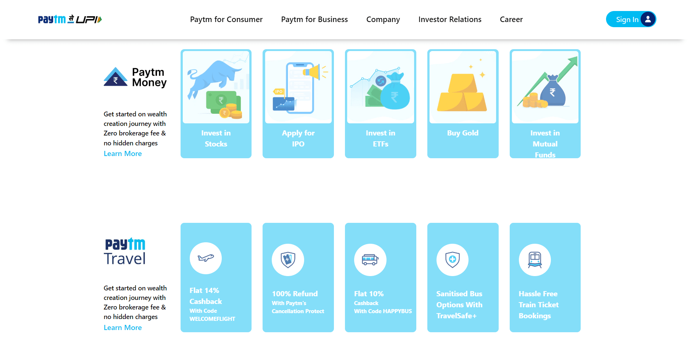

DISCLAIMER: THIS PAGE WAS MADE AS A PERSONAL EDUCATIONAL PROJECT. This is NOT the official site of the company or brand identified on the page. The creator of this page is NOT affiliated with the company or brand in any way. This page is a personal project made in connection with an educational exercise.

 ✨
# Paytm Clone Website Using Tailwind CSS  

I created this paytm clone website responsive with diffrent size of screens. This project is made entirely with html and tailwind css. In this project I have learned about tailwind in-depth.

## Key Learning 
***
- Tailwind CSS 
- Flex and Flexbox
- Mobile First Approach 
- Position 
- Responsive Design

# Deployment Link
  ## [Live Link](https://paytm-clone-02.netlify.app/)
## Preview |
***

## Desktop view
https://user-images.githubusercontent.com/111582082/197241804-c82d9ec3-5064-4610-9638-e9ec8419f498.mp4

## Tablet View
https://user-images.githubusercontent.com/111582082/197241121-b44ac0aa-8414-445c-8609-b2574c0a8e94.mp4

## Mobile View
https://user-images.githubusercontent.com/111582082/197242143-a0f29150-d645-4485-a4d4-4ecbe37e3a00.mp4

## Technologies Used 
***

